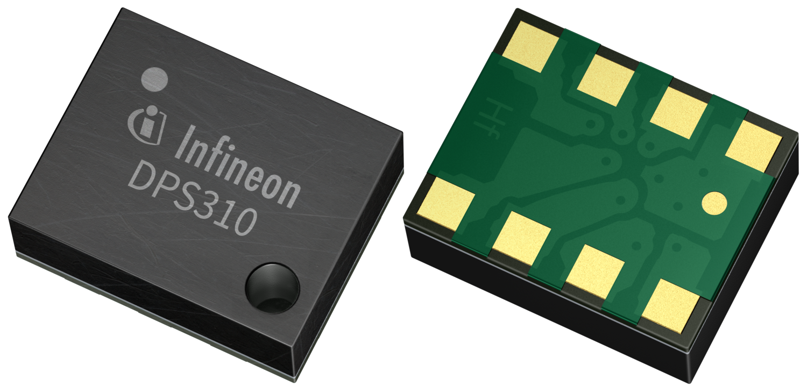
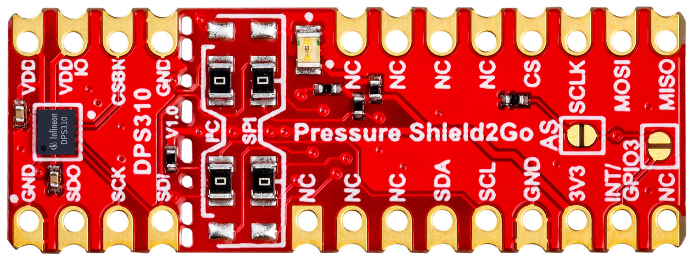
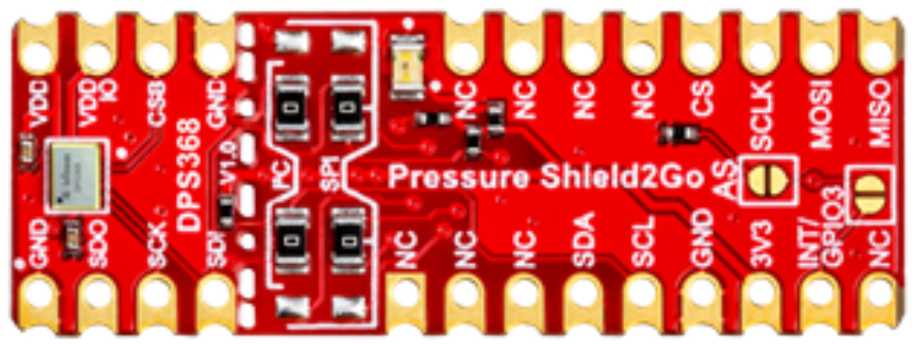
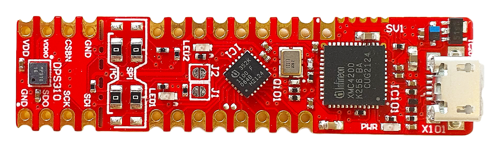
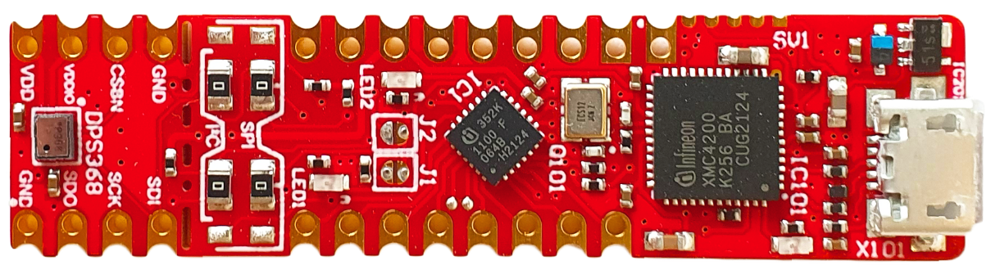

# XENSIV™ Digital Pressure Sensor Arduino Library

Arduino library of Infineon's [**XENSIV™ Digital Pressure Sensors (DPS)**](https://www.infineon.com/cms/en/product/sensor/pressure-sensors/pressure-sensors-for-iot/).


## Supported Products

<table>
    <tr>
        <td rowspan=2>products</td>
        <td></td>
        <td></td>
    </tr>
    <tr>
        <td style="test-align : center"><a href="https://www.infineon.com/cms/de/product/sensor/pressure-sensors/pressure-sensors-for-iot/dps310/">XENSIV™ DPS310</a></td>
        <td style="test-align : center"><a href="https://www.infineon.com/cms/de/product/sensor/pressure-sensors/pressure-sensors-for-iot/dps368/">XENSIV™ DPS368</a></td>
    </tr>
    <tr>
        <td rowspan=2>shield2go</td>
        <td></td>
        <td></td>
    </tr>
    <tr>
        <td style="test-align : center"><a href="https://www.infineon.com/cms/en/product/evaluation-boards/s2go-pressure-dps310/">XENSIV™ DPS310 Shield2Go</a></td>
        <td style="test-align : center"><a href="https://www.infineon.com/cms/en/product/evaluation-boards/s2go-pressure-dps368/">XENSIV™ DPS368 Shield2Go</a></td>
    </tr>
    <tr>
       <td rowspan=2>kit2go</td>
        <td></td>
        <td></td>
    </tr>
    <tr>
        <td style="test-align : center"><a href="https://www.infineon.com/cms/en/product/evaluation-boards/kit_dps310_2go/">XENSIV™ DPS310 Kit 2Go</a></td>
        <td style="test-align : center"><a href="https://www.infineon.com/cms/en/product/evaluation-boards/kit_dps368_2go/">XENSIV™ DPS368 Kit 2Go</a></td>
    </tr>
</table>

## Getting Started

### Installation

To install the digital pressure sensor library in the Arduino IDE, please go to **Sketch** > **Include Library** > **Manage Libraries...** search for the ```DigitalPressureSensor``` library by Infineon in the Arduino library manager.

### Usage
Please see the example sketches in the `/examples` directory in this repository to learn more about the usage of the library. Especially, take care of the respective SPI and I²C configuration of the sensor.

## License

See the [LICENSE](LICENSE.md) file for more details.