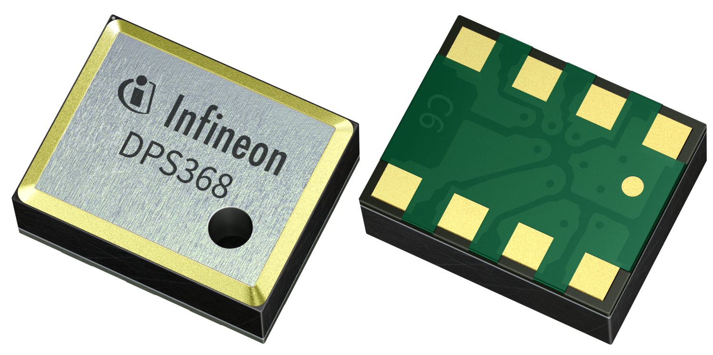

# XENSIV™ Digital Pressure Sensor Arduino Library

Arduino library of Infineon's [**XENSIV™ Digital Pressure Sensors (DPS3xx)**](https://www.infineon.com/cms/en/product/sensor/pressure-sensors/pressure-sensors-for-iot/).

## Supported Products

<table>
    <tr>
        <td rowspan=2>Products</td>
        <td></td>
        <td></td>
    </tr>
    <tr>
        <td style="test-align : center"><a href="https://www.infineon.com/cms/de/product/sensor/pressure-sensors/pressure-sensors-for-iot/dps310/">XENSIV™ DPS310</a></td>
        <td style="test-align : center"><a href="https://www.infineon.com/cms/de/product/sensor/pressure-sensors/pressure-sensors-for-iot/dps368/">XENSIV™ DPS368</a></td>
    </tr>
    <tr>
        <td rowspan=2>Shield2Go</td>
        <td></td>
        <td></td>
    </tr>
    <tr>
        <td style="test-align : center"><a href="https://www.infineon.com/cms/en/product/evaluation-boards/s2go-pressure-dps310/">XENSIV™ DPS310 Shield2Go</a></td>
        <td style="test-align : center"><a href="https://www.infineon.com/cms/en/product/evaluation-boards/s2go-pressure-dps368/">XENSIV™ DPS368 Shield2Go</a></td>
    </tr>
    <tr>
       <td rowspan=2>Kit 2Go</td>
        <td></td>
        <td></td>
    </tr>
    <tr>
        <td style="test-align : center"><a href="https://www.infineon.com/cms/en/product/evaluation-boards/kit_dps310_2go/">XENSIV™ DPS310 Kit 2Go</a></td>
        <td style="test-align : center"><a href="https://www.infineon.com/cms/en/product/evaluation-boards/kit_dps368_2go/">XENSIV™ DPS368 Kit 2Go</a></td>
    </tr>
</table>

## Getting Started

### Installation
To install this library in the Arduino IDE, please go to **Sketch** > **Include Library** > **Manage Libraries...** and search for the `XENSIV Digital Pressure Sensor` library by `Infineon Technologies` in the Arduino library manager.

### Usage
Please see the example sketches in the `/examples` directory in this repository to learn more about the usage of the library. Especially, take care of the respective SPI and I²C configuration of the sensor. You can find more information in the [Wiki](https://github.com/Infineon/arduino-xensiv-dps3xx/wiki).

## License
See the [LICENSE](LICENSE.md) file for more details.
